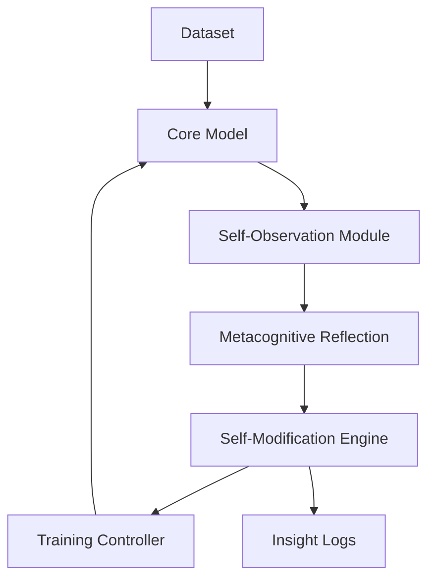

<div align="center">

# 🧠 MetaReflexAI

**A Framework for Metacognitive Capabilities in Language Models**

[](https://www.python.org/downloads/)
[](https://pytorch.org/)
[](LICENSE)

</div>

## 🔍 Overview

**MetaReflexAI** is an experimental AI framework designed to equip language models with **advanced metacognitive capabilities** — enabling them to **observe**, **analyze**, and **adjust** their internal processes during training.

The aim is to move beyond traditional machine learning by embedding a self-reflective cycle directly into the model architecture:

* **Self-Observation:** Real-time analysis of its own behavior, activations, and gradients
* **Reflection:** Generation of insights about internal learning dynamics
* **Autonomous Adjustment:** Modification of its own parameters and training strategies

> ⚠️ **Note:** MetaReflexAI is currently under active development and does not yet include a functional model or completed training pipeline. This repository is for documentation, prototyping, and tracking progress toward the full implementation.

## 🎯 Project Goals

* Design a reusable **metacognitive framework** for PyTorch-based models
* Implement a configurable **observation–reflection–adjustment** cycle
* Develop tools to support **introspection**, **adaptive training**, and **self-correction**
* Document architecture and principles for future contributors

## 🏗️ Proposed Architecture



## 📁 Planned Repository Structure

| Folder        | Description                                        |
| ------------- | -------------------------------------------------- |
| `core/`       | Core modules: observation, reflection, adjustment  |
| `training/`   | Scripts and experiments related to training loops  |
| `prototypes/` | Isolated experimental code (early ideas, testbeds) |
| `docs/`       | Technical documentation and design notes           |
| `examples/`   | Minimal examples of components in action           |

## 🔧 Technical Vision

MetaReflexAI aims to shift the learning paradigm by letting the model act as both **subject** and **scientist** of its own training. The metacognitive cycle may include:

* Tracking loss and weight evolution internally
* Modifying learning rate or optimizer state dynamically
* Generating self-feedback or commentary on its own performance

## 🚧 Current Status

* ✅ Core design concept
* 🟡 Initial prototyping of modules (`self_observation`, `metacognitive_reflection`)
* 🔜 Baseline language model integration
* 🔜 Simple console-based introspection logs
* 🔜 Experiment tracking tools

## 💡 Why This Matters

Traditional models are passive during training. MetaReflexAI explores a future where models **actively reason about their own learning**, potentially leading to:

* More efficient use of data and resources
* Better generalization and fewer training pathologies
* Foundations for **truly adaptive and autonomous agents**

## 📦 Installation (Coming Soon)

This repository currently contains **documentation and development materials** only. Installation and training instructions will be added in upcoming milestones.

## 📜 License

```
Apache License 2.0 © 2025 MetaReflexAI Contributors
```

---

<div align="center">

## 🌐 Get Involved

We're looking for collaborators interested in metacognition, AI architecture, introspective learning, and reflective systems. If you’d like to contribute or follow development:

* 🌍 [GitHub Discussions](https://github.com/youruser/metareflexAI/discussions) *(coming soon)*
* 🧠 \[Submit an idea or experiment as a PR]
* 📬 Contact: \[[your-email@example.com](mailto:your-email@example.com)]

</div>
